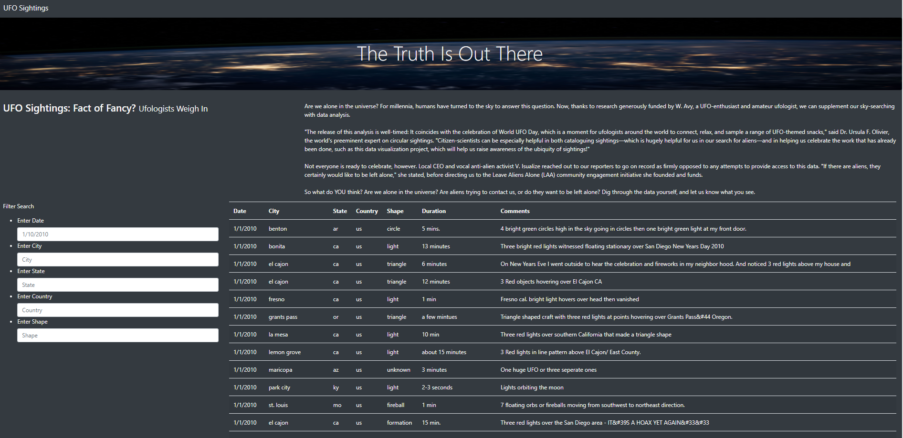
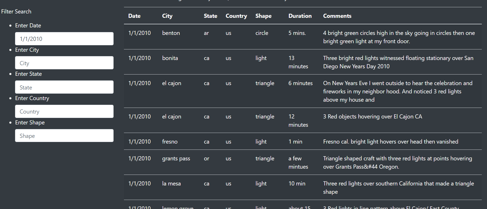

# UFOs

## Overview
The purpose of this project was to create a visually appealing and dynamic page to show UFO sighting records.

## Results
The image below shows the UFO sightings home page. The full dataset is shown here. As seen on the left-hand side of the page, five filters were added to allow users to easier locate the data they are looking for. 

- Below we see an example of a filtered search, by date. By filtering for UFO sightings on 1/1/2010, we see only sightings from that specific date. 

# Summary
This webpage allows users a way to quickly and efficiently search for instances of UFO sightings. By allowing users to filter by date, city, state, country, and shape, users can quickly narrow down their search to find the sighting they are looking for, or explore UFO sightings in a number of ways. 

- Some improvements that could be made to our webpage could be an additional column that provides a link to articles about that particular UFO sighting. While our webpage contains comments about the individual sightings, linking to external articles would enhance the users ability to quickly research their desired UFO sighting. Additionally, the "date" filter could be improved to allow the user to select multiple dates, or a range of dates, while currently they are limited to filtering by one specific date. 
